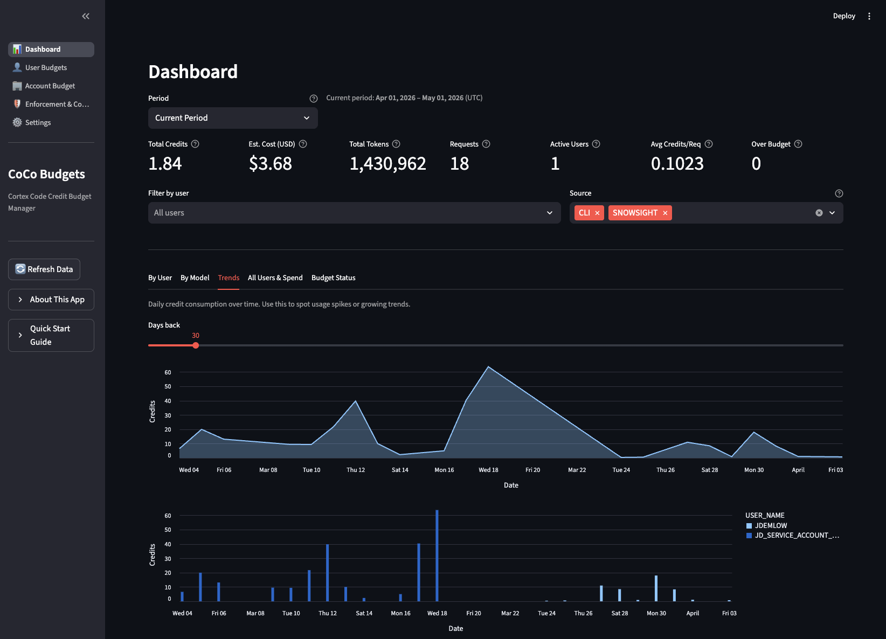
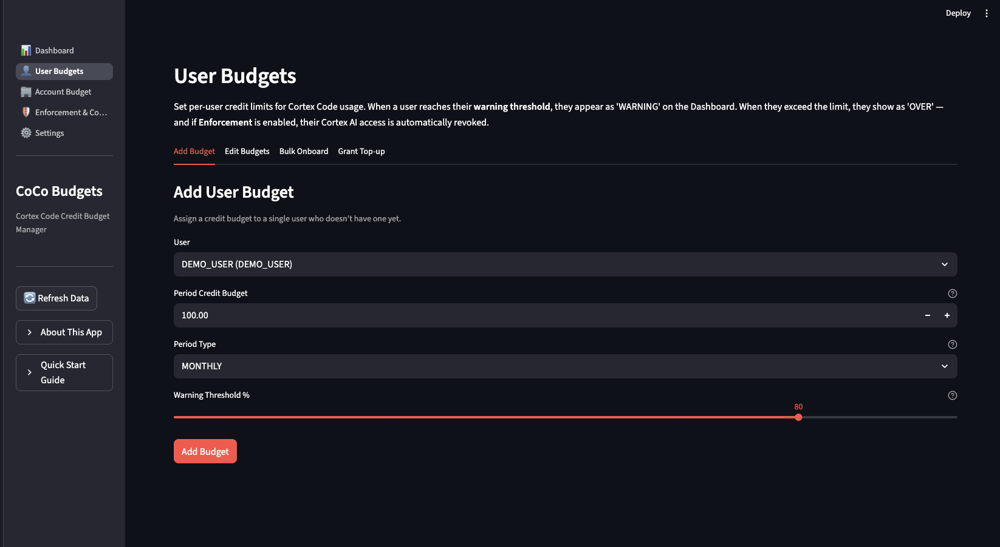
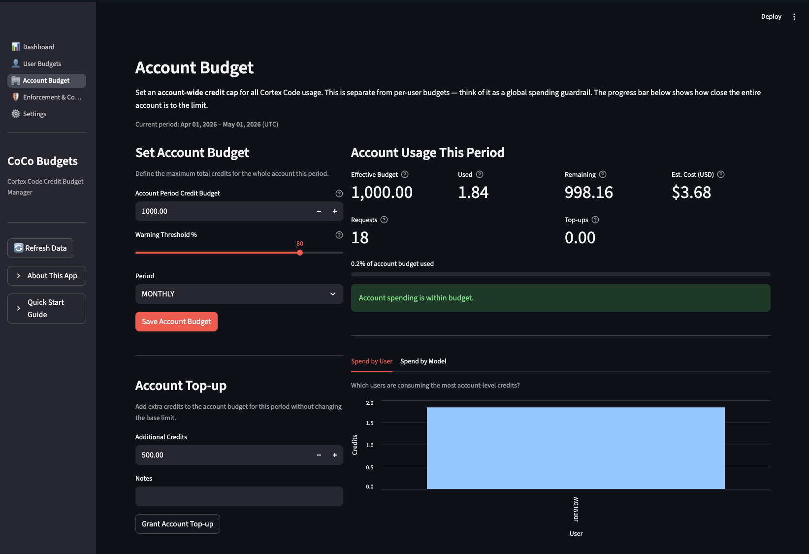
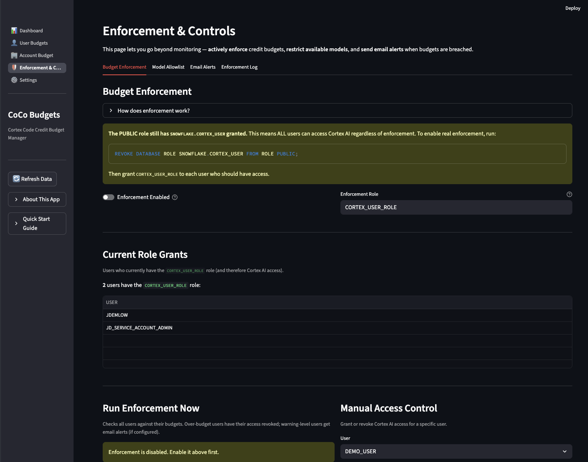
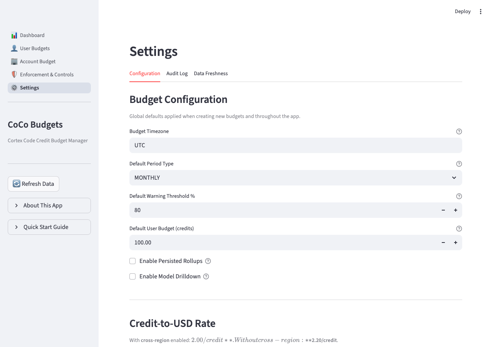

<p align="center">
  <h1 align="center">CoCo Budgets</h1>
  <p align="center">
    <strong>Cortex Code Credit Budget Manager for Snowflake</strong>
  </p>
  <p align="center">
    Monitor, budget, and enforce credit spending for
    <a href="https://docs.snowflake.com/en/user-guide/snowflake-cortex/cortex-code">Cortex Code</a>
    (CLI + Snowsight) across your entire Snowflake account.
  </p>
</p>

---

> **This is not an official Snowflake product.** See [LEGAL.md](LEGAL.md) for full disclaimer.

## Why CoCo Budgets?

Cortex Code (Snowflake's AI coding assistant) charges credits based on token usage across multiple AI models. Without visibility, costs can grow quickly as adoption scales. CoCo Budgets gives administrators:

- **Real-time dashboards** showing credit spend by user, model, and source (CLI vs Snowsight)
- **Native cost controls** using Snowflake's built-in daily credit limit parameters at both account and user level
- **Per-user and account-level budgets** with configurable warning thresholds and top-ups
- **Automated enforcement** that blocks over-budget users by setting their daily credit limits to 0
- **Model allowlist management** to restrict which AI models are available (instant cost control)
- **Email and Slack alerts** for warning and over-budget notifications
- **Scheduled enforcement cycles** via Snowflake Tasks for hands-off management

## Screenshots

### Dashboard
KPI metrics, usage charts by user/model, trend analysis, and budget status tracking.



### User Budgets
Add, edit, and bulk-onboard per-user credit budgets with configurable thresholds.



### Account Budget
Set account-wide credit caps with real-time progress tracking and spend breakdown.



### Enforcement & Controls
Manage native Snowflake cost controls, enforce budgets, manage model allowlists, configure alerts, and schedule automated enforcement.



### Settings
Configure budget defaults, credit-to-USD rates, timezone, and view audit logs.



## Architecture

```
+------------------------------------------------------------------------+
|                          Snowflake Account                              |
|                                                                         |
|  +-------------------------------+  +--------------------------------+ |
|  | SNOWFLAKE.ACCOUNT_USAGE       |  | COCO_BUDGETS_DB.BUDGETS        | |
|  |                               |  |                                | |
|  | CORTEX_CODE_CLI_USAGE_HISTORY |  | USER_BUDGETS       (table)     | |
|  | CORTEX_CODE_SNOWSIGHT_USAGE_  |  | ACCOUNT_BUDGET     (table)     | |
|  |   HISTORY                     |  | BUDGET_TOPUPS      (table)     | |
|  | USERS                         |  | BUDGET_AUDIT_LOG   (table)     | |
|  |                               |  | BUDGET_CONFIG      (table)     | |
|  | (~1 hour data latency)        |  | ENFORCEMENT_LOG    (table)     | |
|  +---------------+---------------+  | ALERT_STATE        (table)     | |
|                  |                  +---------------+----------------+ |
|                  v                                  v                  |
|  +----------------------------------------------------------------+   |
|  |            Streamlit in Snowflake (or local)                    |   |
|  |                                                                 |   |
|  | +----------+ +-------------+ +-----------+ +-----------------+ |   |
|  | | Dashboard| |User Budgets | | Account   | | Enforcement &   | |   |
|  | | - KPIs   | | - Add/Edit  | | Budget    | | Controls        | |   |
|  | | - Charts | | - Bulk Add  | | - Set Cap | | - Cost Controls | |   |
|  | | - Trends | | - Top-ups   | | - Progress| | - Enforcement   | |   |
|  | | - Status | |             | | - By User | | - Allowlist     | |   |
|  | |          | |             | | - By Model| | - Alerts        | |   |
|  | +----------+ +-------------+ +-----------+ | - Scheduling    | |   |
|  |                                             | - Log           | |   |
|  |                                             +-----------------+ |   |
|  +----------------------------------------------------------------+   |
|                                                                         |
|  Native Snowflake Parameters (ALTER ACCOUNT / ALTER USER):              |
|  - CORTEX_CODE_CLI_DAILY_EST_CREDIT_LIMIT_PER_USER                     |
|  - CORTEX_CODE_SNOWSIGHT_DAILY_EST_CREDIT_LIMIT_PER_USER               |
|  - CORTEX_ENABLED_CROSS_REGION (model allowlist)                        |
+------------------------------------------------------------------------+
```

### Budget System Decision Table

| What you need | Use this system |
|---|---|
| Block a user who exceeds a monthly credit limit | Advisory (Enforcement page) |
| Track how much the Engineering team spends on AI Functions + Cortex Code | Native (AI Budgets page) |
| Attribute AI spend across cost centers | Native (AI Budgets page) |
| Restrict which AI models are available account-wide | Model Allowlist (Enforcement page) |

### How the Three Layers Work Together

| Layer | What it does | Blocking? | How it works |
|-------|-------------|-----------|--------------|
| **Advisory budgets** (User Budgets / Account Budget) | Track cumulative period spend against a credit limit | Yes — via Enforcement | Stored in `COCO_BUDGETS_DB.BUDGETS` tables; compared during enforcement cycles |
| **Native Snowflake parameters** (Cost Controls tab) | Cap daily credit usage in a rolling 24-hour window | Yes — natively by Snowflake | `ALTER ACCOUNT/USER SET` parameters |
| **Native Budget objects** (AI Budgets tab) | Track AI spend by team via cost center tags across Cortex Code, AI Functions, Agents, Snowflake Intelligence | No — tracking only | Snowflake `BUDGET` objects; users scoped via `ALTER USER SET TAG` |

### Data Sources

| View | Purpose | Latency |
|------|---------|---------|
| `SNOWFLAKE.ACCOUNT_USAGE.CORTEX_CODE_CLI_USAGE_HISTORY` | CLI credit usage per request | ~1 hour |
| `SNOWFLAKE.ACCOUNT_USAGE.CORTEX_CODE_SNOWSIGHT_USAGE_HISTORY` | Snowsight credit usage per request | ~1 hour |
| `SNOWFLAKE.ACCOUNT_USAGE.USERS` | Maps USER_ID to login name | ~1 hour |

Both usage views retain data for the **last 365 days**. The app unions CLI and Snowsight data with a `SOURCE` column for unified reporting.

### Credit Calculation

Credits are computed from the `TOKENS_GRANULAR` variant column using Snowflake's published token-to-credit rates per model. This approach is more accurate than `TOKEN_CREDITS` alone (which can be `0` for Snowsight rows). The CTE chain: `_requests_cte()` -> `_pricing_cte()` -> `_flatten_cte()` handles all credit math.

## Features

| Feature | Description |
|---------|-------------|
| **Multi-source tracking** | Unified view of CLI and Snowsight usage with source filtering |
| **Native cost controls** | Manage Snowflake's daily credit limit parameters at account and user level |
| **Per-user budgets** | Monthly/weekly/quarterly credit limits with warning thresholds |
| **Account budget** | Global credit cap with progress tracking and spend breakdowns |
| **Budget top-ups** | One-time credit grants (per-user and account-level) with date-bounded effectiveness |
| **Bulk onboarding** | Add budgets for all active users in one click |
| **Automated enforcement** | Block over-budget users by setting daily limits to 0; auto-unblock when under budget |
| **Quick block/unblock** | Instantly block or unblock individual users with one click |
| **Period reset** | Remove all user-level overrides at the start of a new budget period |
| **Model allowlist** | Control which Cortex AI models are available account-wide (instant effect) |
| **Email alerts** | Snowflake notification integration for warning/over-budget events |
| **Slack alerts** | Webhook-based Slack notifications with deduplication |
| **Scheduled enforcement** | Snowflake Task with CRON schedule for hands-off operation |
| **Contextual help** | Expander dropdowns on every action button explaining exactly what it does |
| **Audit logging** | Every budget change and enforcement action tracked with old/new values |
| **Enforcement log** | Detailed log of all block/unblock/reset actions |
| **Configurable credit rate** | Adjust USD-per-credit for cross-region pricing |
| **Model pricing table** | Built-in reference of per-model token-to-credit rates |
| **Progressive loading** | Skeleton UI pattern for responsive feel during data loads |
| **Session keepalive** | Prevents Streamlit WebSocket timeouts during long idle periods |
| **Self-bootstrapping** | App creates its own backend tables on first run |
| **Dual-mode deployment** | Runs locally or in Streamlit in Snowflake |
| **Native AI Budgets** | Create Snowflake Budget objects scoped to teams via cost center tags; tracks Cortex Code, AI Functions, Agents, Snowflake Intelligence |
| **Cost center tagging** | Tag users with cost center values via `ALTER USER SET TAG`; full audit trail in `USER_TAG_ASSIGNMENTS` |
| **Guarded feature isolation** | AI Budgets page uses guarded import — any load failure shows an error on that page only, never crashes the rest of the app |

## Important Limitations

| Limitation | Detail |
|------------|--------|
| **~1 hour data lag** | `ACCOUNT_USAGE` views have up to 1 hour latency. Enforcement decisions are based on lagged data. For instant control, use the Model Allowlist or set daily limits directly in Cost Controls. |
| **Rolling 24h vs period budgets** | Native Snowflake parameters enforce a rolling 24-hour window. App-managed budgets track cumulative period spend. These are complementary but different. |
| **365-day retention** | Source views only cover the last year. |
| **Estimated costs** | USD amounts are approximations based on a configurable credit rate. Always validate against your official Snowflake invoice. |
| **ACCOUNTADMIN required for some operations** | `ALTER ACCOUNT SET CORTEX_MODELS_ALLOWLIST` requires ACCOUNTADMIN. Budget creation and enforcement require `COCO_BUDGETS_OWNER` (see `deploy/rbac.sql`). |
| **Native budgets track, not enforce** | Native Snowflake Budget objects provide attribution and visibility by team; they do not block users. Use Enforcement + User Budgets for hard limits. |
| **SIS Streamlit version** | The app requires Streamlit >= 1.39.0 (for `st.Page`/`st.navigation`). Ensure `environment.yml` specifies a compatible version. |

## Quick Start

### Prerequisites

- **ACCOUNTADMIN** role (required for `ALTER ACCOUNT/USER SET` credit limit parameters)
- A virtual warehouse (default: `COMPUTE_WH`)
- [Snowflake CLI](https://docs.snowflake.com/en/developer-guide/snowflake-cli/index) v3.14.0+ (for SIS deployment)

### 1. Deploy the Backend

Run the backend DDL to create the database, schema, tables, and seed configuration:

```bash
snow sql -f deploy/backend.sql --connection <your_connection>
```

Or paste the contents of `deploy/backend.sql` into a Snowsight worksheet and execute.

### 2. Deploy to Streamlit in Snowflake

```bash
# Create the stage (first time only)
snow sql -f deploy/sis_prereqs.sql --connection <your_connection>

# Deploy the app
cd app
snow streamlit deploy --connection <your_connection> --replace
```

The app will be available in Snowsight under **Streamlit** > **COCO_BUDGETS**.

### 3. (Optional) RBAC Setup

For least-privilege deployments, run `deploy/rbac.sql` as ACCOUNTADMIN. After first run, `COCO_BUDGETS_OWNER` is fully self-sufficient — no ACCOUNTADMIN needed for day-to-day app operations.

| Role | Purpose | Key Privileges |
|------|---------|----------------|
| `COCO_BUDGETS_OWNER` | Owns DB objects; manages budgets, tags, enforcement | IMPORTED PRIVILEGES, MANAGE USER, APPLY TAG, CREATE TAG, CREATE BUDGET |
| `COCO_BUDGETS_APP_USER` | DML on budget tables; can run app and manage budgets | DML on all tables |
| `COCO_BUDGETS_READER` | Read-only dashboard access | SELECT on all tables |

> **Note:** `ALTER ACCOUNT SET CORTEX_MODELS_ALLOWLIST` always requires ACCOUNTADMIN — this is a Snowflake platform constraint that cannot be delegated.

### Self-Bootstrap (Alternative)

Skip steps 1-2 entirely. Create any Streamlit app pointing at `app/streamlit_app.py`. On first load, the app detects missing backend tables and creates them automatically.

## Enforcement & Cost Controls

CoCo Budgets provides **three layers** of cost control, from instant to period-based:

### 1. Model Allowlist (Instant)

Restrict which AI models are available account-wide. Takes effect immediately.

```sql
-- Done via the UI, or manually:
ALTER ACCOUNT SET CORTEX_ENABLED_CROSS_REGION = 'model1,model2';
```

### 2. Native Daily Credit Limits (Rolling 24h)

Set per-user or account-wide daily credit caps using Snowflake's native parameters:

```sql
-- Account-level default (applies to all users)
ALTER ACCOUNT SET CORTEX_CODE_CLI_DAILY_EST_CREDIT_LIMIT_PER_USER = 5.0;
ALTER ACCOUNT SET CORTEX_CODE_SNOWSIGHT_DAILY_EST_CREDIT_LIMIT_PER_USER = 5.0;

-- User-level override (takes priority over account default)
ALTER USER "JSMITH" SET CORTEX_CODE_CLI_DAILY_EST_CREDIT_LIMIT_PER_USER = 10.0;
```

| Value | Meaning |
|-------|---------|
| `-1` | Unlimited (no cap) |
| `0` | Completely blocked |
| `> 0` | Daily credit cap in a rolling 24-hour window |

User-level settings **always override** account-level defaults.

### 3. Budget Enforcement (Period-Based)

The enforcement cycle compares each user's cumulative period spend against their budget:

1. **Over budget** -> Sets user-level daily limits to `0` (blocked on both CLI and Snowsight)
2. **Under budget but currently blocked** -> Removes user-level overrides (restores account defaults)
3. **Under budget and not blocked** -> No action

Enforcement can run manually, or on a schedule via a Snowflake Task.

## Email & Slack Alerts

### Email
Configure in **Enforcement & Controls > Email Alerts**:
1. Create or select a Snowflake notification integration (setup wizard included)
2. Add recipient email addresses
3. Choose alert triggers (warning threshold, over budget)

### Slack
Configure in **Enforcement & Controls > Email Alerts > Slack**:
1. Create an [Incoming Webhook](https://api.slack.com/messaging/webhooks) in your Slack workspace
2. Paste the webhook URL in the app
3. Enable Slack notifications

Alerts are deduplicated — each alert type is sent only once per user per budget period.

## Local Development

```bash
# Create conda environment
conda env create -f local_environment.yml
conda activate coco_budgets

# Set your Snowflake connection
export SNOWFLAKE_CONNECTION_NAME=<your_connection>

# Run the app
cd app
streamlit run streamlit_app.py
```

The app auto-detects whether it's running locally or in SIS and uses the appropriate connection method.

## Project Structure

```
CoCo_Budgets/
+-- app/
|   +-- streamlit_app.py          # Entry point, bootstrap DDL, session keepalive
|   +-- environment.yml           # SIS conda dependencies
|   +-- snowflake.yml             # Snowflake CLI project definition
|   +-- lib/
|   |   +-- db.py                 # All SQL queries, Snowflake connection, native param management
|   |   +-- budget_api.py         # Native Snowflake Budget API (tags, budgets, shared resources)
|   |   +-- time.py               # Period boundary calculations
|   +-- pages/
|       +-- 1_Dashboard.py        # KPIs, charts, trends, budget status
|       +-- 2_User_Budgets.py     # Add/edit/bulk user budgets + top-ups
|       +-- 3_Account_Budget.py   # Account-level budget + progress
|       +-- 4_Settings.py         # Configuration, audit log, data freshness
|       +-- 5_Enforcement.py      # Cost controls, enforcement, allowlist, alerts, scheduling
|       +-- 6_AI_Budgets.py       # Native Snowflake Budget objects, cost center tagging
+-- deploy/
|   +-- backend.sql               # Full backend DDL (tables + config seed, idempotent)
|   +-- rbac.sql                  # Least-privilege roles (includes MANAGE USER fix)
|   +-- ai_budgets_setup.sql      # Optional quick-start: TAG + Budget + shared resources
|   +-- sis_prereqs.sql           # Stage creation for SIS deployment
+-- docs/
|   +-- images/                   # Screenshots for README
+-- local_environment.yml         # Local dev conda environment
+-- LEGAL.md                      # Disclaimer and legal notice
+-- README.md                     # This file
```

## Configuration Reference

All settings are stored in `COCO_BUDGETS_DB.BUDGETS.BUDGET_CONFIG`:

| Key | Default | Description |
|-----|---------|-------------|
| `BUDGET_TIMEZONE` | `UTC` | Timezone for period boundary calculations |
| `DEFAULT_PERIOD_TYPE` | `MONTHLY` | Default budget period (MONTHLY/WEEKLY/QUARTERLY) |
| `DEFAULT_WARNING_THRESHOLD_PCT` | `80` | Default warning threshold percentage |
| `DEFAULT_USER_BASE_PERIOD_CREDITS` | `100` | Default credit budget for new users |
| `CREDIT_RATE_USD` | `2.00` | USD per credit ($2.00 cross-region, $2.20 standard) |
| `ENFORCEMENT_ENABLED` | `false` | Enable automatic budget enforcement (block over-budget users) |
| `EMAIL_INTEGRATION` | `MY_EMAIL_INT` | Snowflake notification integration name |
| `ALERT_RECIPIENTS` | (empty) | Comma-separated email addresses |
| `ALERT_ON_WARNING` | `true` | Send alerts when users hit warning threshold |
| `ALERT_ON_OVER` | `true` | Send alerts when users exceed budget |
| `SLACK_ENABLED` | `false` | Enable Slack webhook notifications |
| `NATIVE_BUDGETS_ENABLED` | `false` | Feature flag for native AI Budgets tab |
| `BUDGET_TAG_DB` | `COCO_BUDGETS_DB` | Database containing the COST_CENTER tag |
| `BUDGET_TAG_SCHEMA` | `BUDGETS` | Schema containing the COST_CENTER tag |
| `BUDGET_TAG_NAME` | `COST_CENTER` | Tag name used for cost center assignment |
| `DEFAULT_NATIVE_BUDGET_QUOTA` | `1000` | Default credit quota when creating native budgets |

## Contributing

Contributions are welcome! Please:

1. Fork the repository
2. Create a feature branch
3. Test locally and in SIS
4. Submit a pull request

## License

Apache License 2.0. See [LEGAL.md](LEGAL.md) for full terms and Snowflake trademark notice.
